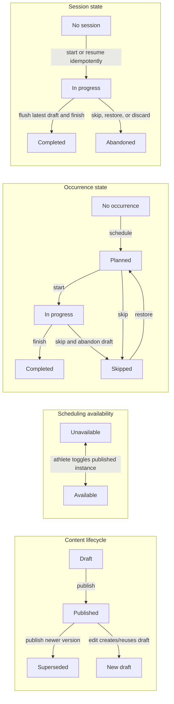

# Lift Log product model and capability contract

This document is the product-language and authorization contract for the stabilization pass. It separates facts stored by the database from viewer-relative presentation and keeps four independent state axes from being collapsed into one generic status.

## Glossary

| Term | Contract |
| --- | --- |
| Account / athlete | Every account is an athlete account. Coaching is an active, revocable relationship capability, never a permanent account role. |
| Program | Finite training content organized into one or more explicit weeks and containing one or more workouts. Programs do not repeat implicitly. |
| Quick workout | Single-workout training content that uses the same workout/section/item/prescription tree as a program but has no multi-week planning UI. It is content, not a logged session. |
| Program instance | The athlete-owned `programs` record through which a program or quick workout is edited, assigned, offered for scheduling, or archived. An assignment creates an independent athlete-owned instance. |
| Program version | A snapshot of prescribed content in `draft`, `published`, or `superseded` lifecycle state. Published and superseded trees are immutable. |
| Workout | Prescribed reusable content inside one program version. It contains sections and item prescriptions, but no performed result. |
| Scheduled workout / occurrence | One workout placed into an athlete's sequence/calendar, optionally on a date, with `planned`, `in_progress`, `completed`, or `skipped` occurrence state. |
| Workout session | The athlete's performed log. It snapshots the prescribed items and moves through `in_progress`, `completed`, or `abandoned`; completed results are immutable. |
| Availability | Whether a published program instance is offered among the athlete's scheduling choices. Availability is not a calendar date and is not evidence of an occurrence. |
| Assignment | An active coach copies their own published source content into an independent athlete-owned instance. A quick-workout assignment may atomically create the first planned occurrence on the coach-provided date. |
| Library | Lift Log-authored immutable source content. An athlete can materialize/schedule it directly or copy it to an editable Own instance. |
| Own | Content authored by the current viewer. “Own” is viewer-relative authorship language; it is not a synonym for athlete database ownership. |
| Coach | Coach-authored content assigned to an athlete. The athlete owns the resulting instance and schedule but cannot edit the prescribed content; the athlete may copy it to Own. |
| Published | A content-lifecycle state. It does not mean available and does not mean scheduled. |
| Available / Ready | A published instance that is eligible to be selected for scheduling. “Ready” is presentation copy for that eligibility, not another database lifecycle. |
| In schedule | The instance is an available scheduling choice. It does not imply that every workout has a date. |

## Independent state axes

The following transitions are independent. UI badges and repository guards must name the axis they represent.

Additional invariants:

- Archiving/deleting a program instance is a container lifecycle and must not erase published snapshots, completed occurrences, or completed sessions.
- Completing early or late records the scheduled occurrence date as `completed_for_date`; it does not silently replace it with “today.”
- Starting/resuming and finishing are exactly-once user actions even when requests are retried or two tabs act concurrently.
- An availability change can create or remove scheduling choices, but it must not rewrite completed history.

## Provenance and viewer-relative presentation

### Stored facts

These facts must remain independent and must not be inferred from one label:

| Fact | Meaning |
| --- | --- |
| `athleteOwnerId` | Account that owns the program instance, schedule, and history. |
| `authorId` | Account that authored the source/prescribed version. |
| `origin` | `library`, `self`, or `coach`. This is durable provenance, not viewer copy. |
| `templateId` / `assignedFromProgramId` | Optional lineage to library or coach source content. |
| `viewerId` | Current account for whom labels and actions are derived. |
| relationship state | Whether the viewer currently has an active coach relationship to the athlete owner. Revocation is effective immediately. |

Unknown provenance stays unknown. Missing provenance must never default to Library.

### Presentation projection

| Stored origin and viewer relation | Badge | Accessible title |
| --- | --- | --- |
| Library | Library | Lift Log library |
| Self-authored and `viewerId === authorId` | Own | Created by you |
| Self-authored and viewer is an active coach of the athlete | Athlete · _name_ | Created by _athlete name_ |
| Coach-authored and `viewerId === authorId` | Coach · You | Assigned by you |
| Coach-authored and viewer is the athlete owner | Coach · _name_ | Created by your coach, _name_ |
| Coach-authored and another authorized viewer | Coach · _name_ | Created by _name_ for _athlete name_ |

The same projection is used in Programs, Next workouts, Calendar, and Coaching. It must not rely on a preformatted `sourceLabel` returned by one repository path.

## Capability rules

UI visibility is not authorization. The UI consumes these pure policies for consistent affordances, handlers check them again, repository methods reject invalid requests, and RPC/RLS/trigger checks remain authoritative.

Legend: **Yes** = allowed; **No** = denied; **Conditional** = allowed only under the rule shown.

### Content capabilities

| Viewer/content context | View | Copy to Own | Edit / create draft | Publish | Toggle availability | Schedule | Assign | Delete/archive |
| --- | --- | --- | --- | --- | --- | --- | --- | --- |
| Athlete viewing Library | Yes | Yes | No | No | Materialize only | Yes, through athlete-owned materialization | No | No |
| Athlete viewing their Own draft | Yes | No | Yes | Yes | No | No | No | Yes, preserving history |
| Athlete viewing their Own published instance | Yes | No | Yes, by creating/reusing a draft | No until a draft exists | Yes | Yes when available | Yes if the viewer also has active athletes; assignment source must be their own published content | Yes/archive, preserving published/history references |
| Athlete viewing coach-assigned content | Yes | Yes | No | No | Yes | Yes when available | No | Remove/archive instance only through a history-preserving boundary |
| Active authoring coach viewing their athlete-specific coach draft | Yes | No | Yes while relationship is active | Yes while relationship is active | No | No | No; this is already an assigned copy | No |
| Active authoring coach viewing their published athlete copy | Yes | No | Yes, by creating/reusing an authorized future draft | No until a draft exists | No | No, except the one-shot quick-assignment date below | No | No |
| Active coach assigning their own published source | Yes | No | Source edit follows Own rules | No until a draft exists | Own athlete workspace only | Own athlete workspace only | Yes, only to actively connected athletes | Own source follows Own rules |
| Other active coach of the same athlete | No; coaching access is author-scoped | No | No | No | No | No | No | No |
| Unrelated or revoked viewer | No | No | No | No | No | No | No | No |

Quick-workout date exception:

- During assignment only, the authoring coach may provide the initial planned date in the same transactional RPC that creates the athlete-owned copy.
- The coach is recorded as the creator of that initial placement, but the athlete owns the occurrence and all subsequent calendar actions.
- The coach cannot later reschedule, skip, restore, remove, start, or complete the occurrence.

### Occurrence and session capabilities

| Action | Athlete owner | Active authoring coach | Other/revoked coach |
| --- | --- | --- | --- |
| View planned occurrence | Yes | Read-only only when the occurrence came from that coach's authored program | No |
| View in-progress/completed session | Yes | Results for occurrences from that coach's authored program while the relationship is active; private athlete notes are excluded | No |
| Start/resume | `planned` or the matching `in_progress` occurrence only | No | No |
| Reschedule | Athlete-owned non-completed occurrence only; active-session handling must be explicit | No after assignment | No |
| Skip | `planned` or `in_progress`; an active draft becomes abandoned | No | No |
| Restore | `skipped` only | No | No |
| Remove occurrence | Athlete-owned non-completed occurrence only | No | No |
| Edit result / actual RPE | Matching `in_progress` session only | No | No |
| Finish | Matching `in_progress` session after latest draft revision is confirmed | No | No |
| Edit completed result | No | No | No |

## Approved implementation decisions

These product and release decisions are resolved. Remaining entries in the implementation-alignment section describe engineering work, not open product choices.

1. **Coach visibility — author-scoped.** An active coach can see basic athlete identity, programs and drafts they authored for that athlete, occurrences produced from those program versions, and the corresponding results/feedback. They cannot see another coach's programs, athlete-authored programs, unrelated history, or private athlete notes. Relationship revocation removes access immediately.
2. **Workout logging — online required.** Typed values remain in memory during a temporary interruption, but persistence and completion require the development service to be reachable. The session UI must expose `Saving…`, `Saved`, and `Unsaved — reconnect to save` (or an actionable save error). Completion must wait for the latest atomic, revision-confirmed draft; it must never make an unconfirmed draft immutable.
3. **Historical metadata — version snapshot.** Every program version snapshots title and description. Published/superseded detail, schedules, completed history, and coach agenda use the referenced version's metadata, so later renames cannot rewrite historical labels.
4. **Browser support — approved minima.** The supported floors are iOS/iPadOS Safari 17.4, Android Chrome 120, desktop Chrome/Edge 120, Firefox 121, and Safari 17.4, as maintained in [BROWSER_SUPPORT.md](BROWSER_SUPPORT.md).
5. **Capacity envelope — approved.** Default authenticated bootstrap is limited to six bounded Data API calls; one program/workout/session detail open to two calls; request count per page must remain O(1); shaped mobile-4G bootstrap p95 is at most 2.5 seconds; cached navigation p95 is at most 500 ms; screen-summary database queries p95 are at most 200 ms in the scale environment; initial responses exclude full history/exercise/template/coach graphs unless requested; and initial bundle size must not regress from the measured baseline. The named scale gates remain 100/250 programs or coached athletes, 1,001/5,000 occurrences and sessions, 5,000 exercises, 52-week trees, historical versions, and the maximum assignment batch.
6. **Development rollout — approved.** The pending migrations are approved only for hosted development project `ofyeejyfroblunbspgve`. Deploy the compatible frontend to `dev.liftlog.cc` immediately after the development migrations, run the smoke gate, and roll back the development frontend/database compatibility changes if smoke tests fail. This is not production deployment or production-data authorization.

## Tracking, units, and dates

- Exercise identity, prescription, and performed result are separate snapshots.
- `entry_mode` selects the logging structure; `tracking_fields` selects the actual inputs. A field not present in `tracking_fields` is not rendered, persisted, or required merely because of the mode.
- Planned RPE is prescription data; actual RPE is performed/session data. Both use whole numbers 1–10 and the same vocabulary/color scale.
- Load is stored canonically in kilograms and displayed/entered in the account's kg/lb preference. Distance is stored canonically in metres/kilometres and displayed/entered in km/mi. Preference changes never rewrite historical canonical values.
- A date-only value is parsed/formatted by the central date-only utility and never by appending a local/UTC timestamp ad hoc. Calendar-week and overdue rules use the account timezone and week-start preference.

## Implementation-alignment status

1. **Implemented and validated in hosted development:** provenance is projected with viewer context, and absent provenance remains Unknown rather than falling back to Library.
2. **Partially resolved:** shared capability policies drive the high-risk program and occurrence actions, handlers re-check them, and the visible coach capability copy now matches the author-scoped contract. `LiftLogApp.tsx` still contains local action predicates, and the remaining monolith/feature-boundary refactor is open.
3. **Implemented and validated in hosted development:** `202608240004_author_scoped_coach_reads.sql` and `202608240006_enforce_author_scoped_revisioned_contract.sql` narrow coach RLS and private-data projections to authored programs, their occurrences/results, and basic athlete identity. Unrelated history and private notes remain denied, including after relationship revocation.
4. **Implemented and validated in hosted development:** `202608240001_schedule_provenance_and_safe_session_start.sql` preserves immutable scheduling provenance and the coach-provided quick-assignment date. `202608240002_align_copy_capability_and_availability_grant.sql` aligns `copy_program_to_own()` with the approved capability and grants authenticated reads of `program_availability`.
5. **Implemented and validated in hosted development:** `202608240003_program_version_metadata_snapshots.sql` stores title/description snapshots on program versions, and repository projections use those immutable labels for schedule, history, and coach views.
6. **Implemented and validated in hosted development:** `202608240005_revisioned_session_drafts.sql`, `202608240006_enforce_author_scoped_revisioned_contract.sql`, and `202608240007_non_retryable_session_revision_conflicts.sql` provide atomic revisioned online saves, token idempotency, revision-confirmed completion, and non-retryable PT409 handling for stale/revision conflicts. The client serializes autosave and flushes before completion; real-device offline, backgrounding, reconnect, and recovery validation remains open.
7. **Implemented and validated in hosted development:** `202608240008_bounded_coach_workspace_overview.sql` replaces the coach overview fan-out with one author-scoped identity/count overview capped at 250 athletes and one lazy selected-athlete detail capped at 250 programs, 104 progress markers per program, six upcoming items, and six completed items. This bounds the coaching read shape; it does not satisfy the global six-call bootstrap target or replace maximum-cardinality/query-plan evidence.
8. **Resolved policy; device evidence open:** supported browser minima are recorded in `docs/BROWSER_SUPPORT.md`, and automated engine coverage exists. The required real-device and offline/reconnect release checks remain engineering gates.
9. **Capacity target not yet met:** the global workspace bootstrap still exceeds the approved six-call envelope. Maximum-cardinality fixtures, authenticated query plans, and scale evidence remain open; the bounded coach RPCs alone do not close this gate.
10. **Architecture cleanup remains open:** the `LiftLogApp.tsx` and repository monoliths still require incremental feature extraction and reusable-UI consolidation after the stabilized contracts above.
11. **Hosted development rollout complete through migration 008:** the compatible frontend and migrations `202608240001` through `202608240008` are applied on `dev.liftlog.cc` and have passed the supported hosted-development integration and smoke checks. Production is explicitly untouched; no production deployment or production-data modification was performed.

## Resolved coach-visibility decision

The approved contract is author-scoped programming and history. An active coach sees only their own athlete-specific coach programs/drafts, occurrences derived from those versions, corresponding result values/feedback, and basic athlete identity. Other programs, unrelated history, and private notes are denied. The database's formerly broad active-coach read policies are an implementation defect to narrow, not an alternative supported product mode.

`coach_feedback` remains a separate dormant surface: it is modeled and authorized in SQL but has no repository/UI feature. If implemented, feedback visibility must follow the same authored-program and active-relationship boundary.
