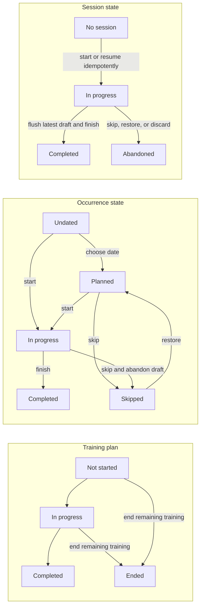

# Lift Log product model and capability contract

This document is the product-language and authorization contract. The user model is **workouts and programs**: create, optionally set dates, start, repeat, and assign. Creating training immediately puts it in Training. There is no separate Plan, Use, or Add to training action. Templates, publication, saved versions, availability switches, and “in use” editing locks are internal implementation concerns, not decisions users must make.

Opening training shows its actions; Edit, Create, and Repeat open the editor. The editor uses Save to return to the action view, with background persistence retained for recovery. Programs show a selectable workout list at every viewport. Workout duration is optional and is never estimated by default. Exercise search can add the typed name as a workout-only snapshot; this does not create a library exercise, and copying or assigning the workout carries the snapshot with it.

The September 21 workout/program refactor was verified locally. The subsequent unified Training approach is being implemented locally; see [its scope and review](review/2026-09-21-unified-training.md). Neither refactor has been deployed to hosted development.

## Glossary

| Term | Contract |
| --- | --- |
| Account / athlete | Every account is an athlete account. Coaching is an active, revocable relationship capability, never a permanent account role. |
| Workout | One training session with an ordered exercise list and prescribed targets. It can stand alone or belong to a program. The UI uses the same word before and after it is planned; performed results remain separate internally. |
| Program | A finite, ordered group of workouts. Dates are optional; the editor does not expose database weeks or versions. |
| Training | The default home for all created and assigned workouts/programs. It groups unfinished training into Today and overdue, Upcoming, and No date; History shows finished or ended training and completed workout results. |
| Set dates / Change dates | Choose or change dates on existing training. A standalone workout uses one date screen; a program exposes its unfinished workouts together. This action does not create a repeat. |
| Start workout | Start the selected unfinished workout, including one without a date. Only its athlete may start or record it. An existing active session is resumed. |
| Repeat | Open a fresh editable, undated copy in Training. Repeating a program includes its exercise and target changes; repeating a completed workout copies its prescribed content. Actual results are references, not new targets. |
| Assign | Give currently connected athletes independent copies of the selected training, optionally with dates. Later edits affect only the selected athlete's upcoming workout. |
| My training / From coach | Viewer-relative source groupings. Coaching is provenance and authorization, not a different workout format. |
| Planned workout / occurrence | One athlete's particular workout, with an optional date. A future occurrence can be edited independently; starting freezes its prescribed content. |
| Workout session | The performed log and its instruction/media snapshots. It moves through `in_progress`, `completed`, or `abandoned`; completed results are immutable. |
| Run, source container, version | Internal records that preserve ordering, authorship, independent copies, and historical snapshots. They are not additional user-facing objects. |

`quick_workout`, `templateId`, publication states, and legacy availability records remain internal compatibility names where needed. Their existence does not require template management or a Publish action in the product.

## Independent state axes

Training progress, occurrence state, and performed results remain independent. UI badges name the user's training state; internal version state does not become a visible editing lock.

Additional invariants:

- Creating or repeating puts training in the No date group immediately. Dates are optional metadata, never a condition for starting or a second activation step.
- Repeating creates a separate editable copy with all dates cleared. Editing it never updates its original, another repeat, or another athlete's training.
- Editing an upcoming workout changes only that occurrence. Its hidden draft is frozen atomically when the athlete starts; started or completed workouts cannot be edited through the planning editor.
- Deleting an untouched own workout/program removes it from Training. Ending started training cancels its remaining work and retains completed history. Neither action erases another athlete's copies or results.
- Skipping a workout and ending the remaining program are explicit progress actions. An undated workout is still unfinished work, not an inferred skip.
- Completing early or late records the scheduled occurrence date as `completed_for_date`; it does not silently replace it with “today.”
- Starting/resuming and finishing are exactly-once user actions even when requests are retried or two tabs act concurrently.
- Source records already represented by the athlete's runs are not shown as duplicate template cards; this holds across paginated reads.
- A program is one expandable Training card, ordered by its next unfinished workout's date. Its individual workouts are revealed inside the card; standalone workout cards and program cards are not duplicated as another Next list.
- Calendar is another view of the same training. Choosing training there changes existing dates; clearing a date returns unfinished training to No date. Creating another copy requires Repeat.
- Navigation is Training, Calendar, Exercises, and Coaching. Historical Next links resolve to Training; an active workout remains reachable through Resume and recoverable across reloads.

## Provenance and viewer-relative presentation

### Stored facts

These facts must remain independent and must not be inferred from one label:

| Fact | Meaning |
| --- | --- |
| `athleteOwnerId` | Account that owns the particular training plan, schedule, and performed history. The source content may have a different author/owner. |
| `authorId` | Account that authored the source/prescribed version. |
| `origin` | `library`, `self`, or `coach`. This is durable provenance, not viewer copy. |
| `templateId` / `assignedFromProgramId` | Optional lineage to library or coach source content. |
| `viewerId` | Current account for whom labels and actions are derived. |
| relationship state | Whether the viewer currently has an active coach relationship to the athlete owner. Revocation is effective immediately. |

Unknown provenance stays unknown. Missing provenance must never default to Library.

### Presentation projection

| Stored origin and viewer relation | Badge | Accessible title |
| --- | --- | --- |
| Library | Library | Lift Log library |
| Self-authored and `viewerId === authorId` | Own | Created by you |
| Self-authored and viewer is an active coach of the athlete | Athlete · _name_ | Created by _athlete name_ |
| Coach-authored and `viewerId === authorId` | Coach · You | Assigned by you |
| Coach-authored and viewer is the athlete owner | Coach · _name_ | Created by your coach, _name_ |
| Coach-authored and another authorized viewer | Coach · _name_ | Created by _name_ for _athlete name_ |

The same projection is used in Training, Calendar, and Coaching. It must not rely on a preformatted `sourceLabel` returned by one repository path.

## Capability rules

UI visibility is not authorization. The UI consumes these pure policies for consistent affordances, handlers check them again, repository methods reject invalid requests, and RPC/RLS/trigger checks remain authoritative.

Legend: **Yes** = allowed; **No** = denied; **Conditional** = allowed only under the rule shown.

### Content capabilities

| Viewer/content context | Edit | Repeat | Set / change dates | Assign | Delete / end |
| --- | --- | --- | --- | --- | --- |
| Own unstarted workout/program | Yes | Fresh editable, undated copy | Optional dates; any unfinished workout may start without a date | To actively connected athletes | Remove own training; preserve existing copies/history |
| Athlete's upcoming workout, including assigned training | This occurrence only | Fresh editable own copy | Choose/change dates on future work | Own training only; a repeated copy becomes own training | End remaining plan; preserve completed work |
| Athlete's started/completed workout | No prescribed-content edits; active actuals use the logger | Fresh editable copy; previous actuals remain reference hints | New copies only | Own training/copies only | Completed history remains |
| Active authoring coach viewing their assigned plan | Future workouts only, independently for that athlete | Copy exact readable plan | Schedule future workouts in that assigned plan | Own training/copies to current athletes | End remaining assigned plan |
| Other coach or revoked viewer | No | No access to that athlete's plan/copy | No | No | No |

Publication and hidden drafts are handled atomically by the repository/database. Users do not publish training, choose versions, or resolve “template in use” prompts. Assigning a selected run copies its effective content, including occurrence edits, instead of silently assigning its older source.

### Occurrence and session capabilities

| Action | Athlete owner | Active authoring coach | Other/revoked coach |
| --- | --- | --- | --- |
| View planned occurrence | Yes | Only when it came from that coach's authored plan and the relationship remains active | No |
| Edit upcoming prescription | Before any session exists for that occurrence | Same rule for that coach's own assigned plan | No |
| View in-progress/completed session | Yes | Results for occurrences from that coach's authored program while the relationship is active; private athlete notes are excluded | No |
| Start/resume | `planned` or the matching `in_progress` occurrence only | No | No |
| Reschedule | Future planned occurrence only | Future workouts in the coach's own assigned plan | No |
| Skip | `planned` or `in_progress`; an active draft becomes abandoned | No | No |
| Restore | `skipped` only | No | No |
| End plan | No active workout; cancel remaining work and keep completed history | Same rule for that coach's own assigned plan | No |
| Edit result / actual RPE | Matching `in_progress` session only | No | No |
| Finish | Matching `in_progress` session after latest draft revision is confirmed | No | No |
| Edit completed result | No | No | No |

## Approved implementation decisions

These product and release decisions are resolved. Remaining entries in the implementation-alignment section describe engineering work, not open product choices.

1. **Coach visibility — author-scoped.** An active coach can see basic athlete identity, programs and drafts they authored for that athlete, occurrences produced from those program versions, and the corresponding results/feedback. They cannot see another coach's programs, athlete-authored programs, unrelated history, or private athlete notes. Relationship revocation removes access immediately.
2. **Workout logging — locally recoverable, online-confirmed.** Typed values are kept in a short-lived, user/session-scoped browser draft so phone lock, tab backgrounding, a temporary interruption, or a genuine reload does not discard the active workout. Server persistence and completion still require the development service to be reachable. The session UI exposes `Saving…`, `Saved`, and `Saved on this device · reconnect to sync` (or an actionable save/storage error). Recovery retains the exact last server-confirmed base and three-way merges non-conflicting local and remote fields; if the same field changed in two copies, a blocking choice keeps either side for only those conflicts. Completion waits for the latest atomic, revision-confirmed server draft; it never makes an unconfirmed draft immutable. Local recovery data is cleared immediately after confirmed completion/abandonment and on account exit.
3. **Historical metadata — version snapshot.** Every program version snapshots title and description. Published/superseded detail, schedules, completed history, and coach agenda use the referenced version's metadata, so later renames cannot rewrite historical labels.
4. **Browser support — approved minima.** The supported floors are iOS/iPadOS Safari 17.4, Android Chrome 120, desktop Chrome/Edge 120, Firefox 121, and Safari 17.4, as maintained in [BROWSER_SUPPORT.md](BROWSER_SUPPORT.md).
5. **Capacity envelope — approved.** Default authenticated bootstrap is limited to six bounded Data API calls; one program/workout/session detail open to two calls; request count per page must remain O(1); shaped mobile-4G bootstrap p95 is at most 2.5 seconds; cached navigation p95 is at most 500 ms; screen-summary database queries p95 are at most 200 ms in the scale environment; initial responses exclude full history/exercise/template/coach graphs unless requested; and initial bundle size must not regress from the measured baseline. The named scale gates remain 100/250 programs or coached athletes, 1,001/5,000 occurrences and sessions, 5,000 exercises, 208-workout sequences, historical versions, and the maximum assignment batch.
6. **Deployment scope.** Earlier approvals covered their specific hosted development releases on `dev.liftlog.cc` / `ofyeejyfroblunbspgve`. They are not standing authorization to deploy later refactors or change production. The September 21 workout/program refactor remains local for review; any later deployment must follow the current user instruction and retain an atomic rollback target.

## Tracking, units, and dates

- Exercise identity, prescription, and performed result are separate snapshots.
- `entry_mode` selects the logging structure; `tracking_fields` selects the actual inputs. A field not present in `tracking_fields` is not rendered, persisted, or required merely because of the mode.
- New weighted strength exercises default to reps and weight. RPE remains available under optional tracking fields and is off by default; bodyweight, timed, distance, interval, and instruction-only exercises retain their appropriate base metrics. Existing prescribed fields and deliberately chosen personal exercise defaults are preserved.
- Planned RPE is prescription data; actual RPE is performed/session data. Both use whole numbers 1–10 and the same vocabulary/color scale.
- Starting prefills exact objective targets, while ranges and actual effort remain blank. Finishing assumes remaining, undeleted entries were completed. Previous performed values appear as muted references inside the cells and never become actuals merely by opening or completing a workout.
- Load is stored canonically in kilograms and displayed/entered in the account's kg/lb preference. Distance is stored canonically in metres/kilometres and displayed/entered in km/mi. Preference changes never rewrite historical canonical values.
- A date-only value is parsed/formatted by the central date-only utility and never by appending a local/UTC timestamp ad hoc. Calendar-week and overdue rules use the account timezone and week-start preference.

## Implementation-alignment status

The historical entries below describe earlier stabilization work. For the current local refactor, migration `202609210001` makes default RPE optional and `202609210002` supplies isolated future edits, repeat/assignment copying, hidden snapshot protection, and history reuse. Both are applied to the local database (93 migrations total), with API, SQL, portable replay, and real desktop/mobile browser evidence in [the September 21 review](review/2026-09-21-training-refactor.md). These changes are not yet deployed to hosted development.

1. **Implemented and validated in hosted development:** provenance is projected with viewer context, and absent provenance remains Unknown rather than falling back to Library.
2. **Partially resolved:** shared capability policies drive the high-risk program and occurrence actions, handlers re-check them, and the visible coach capability copy now matches the author-scoped contract. `LiftLogApp.tsx` still contains local action predicates, and the remaining monolith/feature-boundary refactor is open.
3. **Implemented and validated in hosted development:** `202608240004_author_scoped_coach_reads.sql` and `202608240006_enforce_author_scoped_revisioned_contract.sql` narrow coach RLS and private-data projections to authored programs, their occurrences/results, and basic athlete identity. Unrelated history and private notes remain denied, including after relationship revocation.
4. **Implemented and validated in hosted development:** `202608240001_schedule_provenance_and_safe_session_start.sql` preserves immutable scheduling provenance and the coach-provided quick-assignment date. `202608240002_align_copy_capability_and_availability_grant.sql` aligns `copy_program_to_own()` with the approved capability and grants authenticated reads of `program_availability`.
5. **Implemented and validated in hosted development:** `202608240003_program_version_metadata_snapshots.sql` stores title/description snapshots on program versions, and repository projections use those immutable labels for schedule, history, and coach views.
6. **Implemented locally; hosted-device validation pending:** `202608240005_revisioned_session_drafts.sql`, `202608240006_enforce_author_scoped_revisioned_contract.sql`, and `202608240007_non_retryable_session_revision_conflicts.sql` provide atomic revisioned online saves, token idempotency, revision-confirmed completion, and non-retryable PT409 handling for stale/revision conflicts. The client serializes autosave, preserves a scoped local recovery snapshot and its confirmed base, survives redundant same-user auth/refocus events, merges bounded stale conflicts from an authoritative session read, resumes sync on page foreground/reconnect, and flushes before completion. Ambiguous draft and completion responses replay the same idempotency token; deterministic failures do not poison newer snapshots. Automated lifecycle/reload/conflict/finish coverage passes; real iPhone and Android background/reload validation remains open.
7. **Implemented and validated in hosted development:** `202608240008_bounded_coach_workspace_overview.sql` replaces the coach overview fan-out with one author-scoped identity/count overview capped at 250 athletes and one lazy selected-athlete detail capped at 250 programs, 104 progress markers per program, six upcoming items, and six completed items. This bounds the coaching read shape; it does not satisfy the global six-call bootstrap target or replace maximum-cardinality/query-plan evidence.
8. **Resolved policy; device evidence open:** supported browser minima are recorded in `docs/BROWSER_SUPPORT.md`, and automated engine coverage exists. The required real-device and offline/reconnect release checks remain engineering gates.
9. **Capacity target not yet met:** the global workspace bootstrap still exceeds the approved six-call envelope. Maximum-cardinality fixtures, authenticated query plans, and scale evidence remain open; the bounded coach RPCs alone do not close this gate.
10. **Architecture cleanup remains open:** the `LiftLogApp.tsx` and repository monoliths still require incremental feature extraction and reusable-UI consolidation after the stabilized contracts above.
11. **Hosted development rollout complete through migration 008:** the compatible frontend and migrations `202608240001` through `202608240008` are applied on `dev.liftlog.cc` and have passed the supported hosted-development integration and smoke checks. Production is explicitly untouched; no production deployment or production-data modification was performed.

## Resolved coach-visibility decision

The approved contract is author-scoped programming and history. An active coach sees only their own athlete-specific coach programs/drafts, occurrences derived from those versions, corresponding result values/feedback, and basic athlete identity. Other programs, unrelated history, and private notes are denied. The database's formerly broad active-coach read policies are an implementation defect to narrow, not an alternative supported product mode.

`coach_feedback` remains a separate dormant surface: it is modeled and authorized in SQL but has no repository/UI feature. If implemented, feedback visibility must follow the same authored-program and active-relationship boundary.
